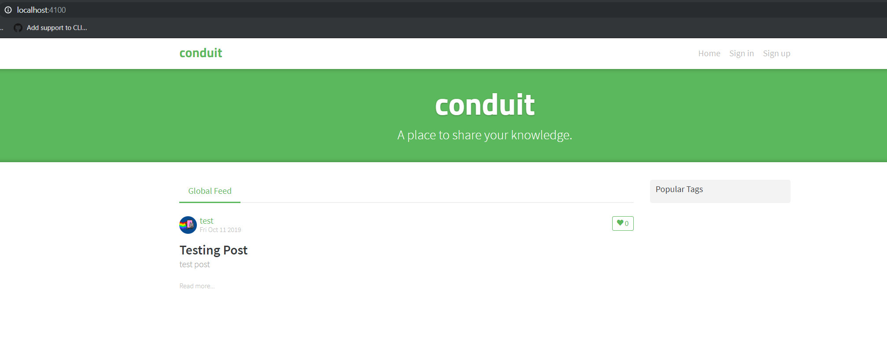
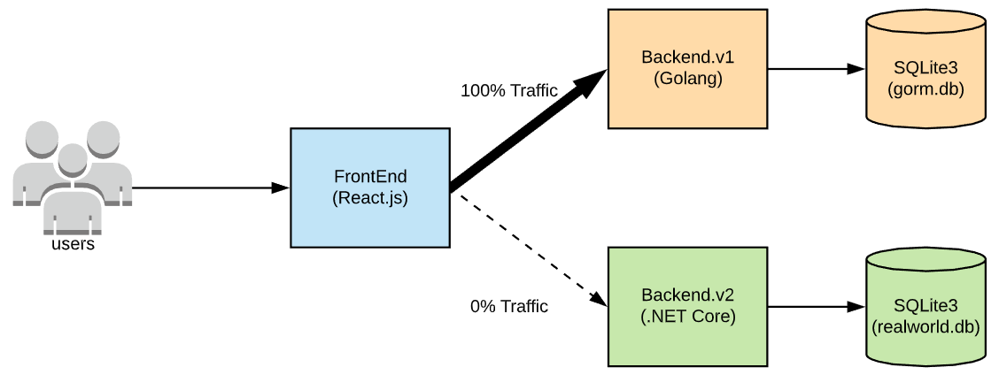
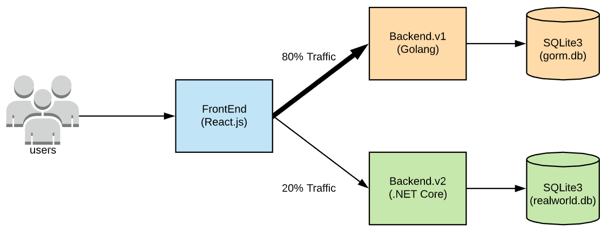
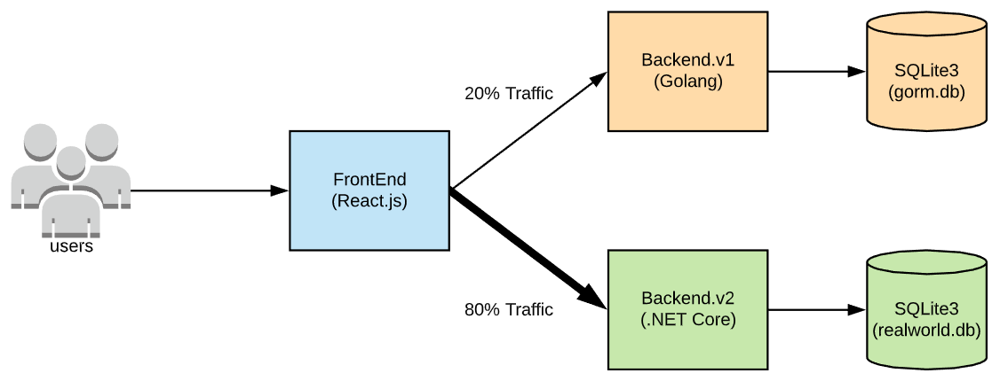
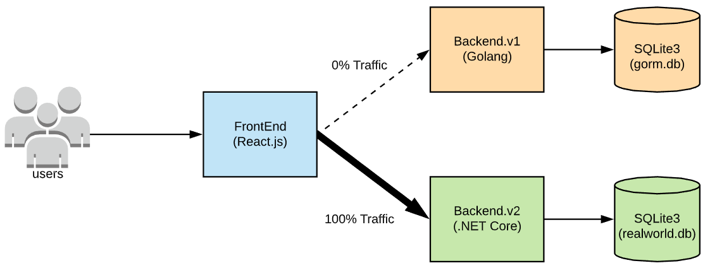

# Migration proposal

## The application

The application is a copy of Medium.com and the features include Authentication,
user management, persistence, and blogging.

## The current architecture

We only have 1 frontend application, and 100% traffic should still go to the backend.v1.

We can try with [Canary Release](https://martinfowler.com/bliki/CanaryRelease.html)

> Canary release is a technique to reduce the risk of introducing a new software version in production by slowly rolling out the change to a small subset of users before rolling it out to the entire infrastructure and making it available to everybody.

## Plan of action

